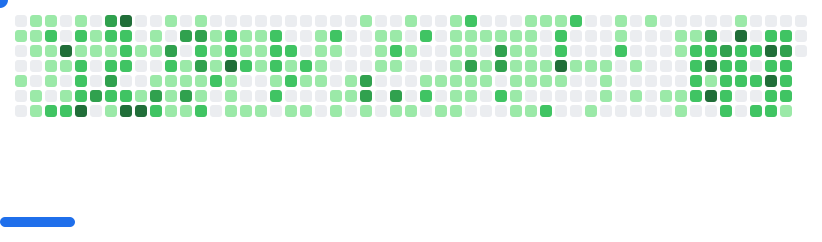

<!--
**checho1402/checho1402** is a ✨ _special_ ✨ repository because its `README.md` (this file) appears on your GitHub profile.

Here are some ideas to get you started:

- 🔭 I’m currently working on ...
- 🌱 I’m currently learning ...
- 👯 I’m looking to collaborate on ...
- 🤔 I’m looking for help with ...
- 💬 Ask me about ...
- 📫 How to reach me: ...
- 😄 Pronouns: ...
- ⚡ Fun fact: ...
-->

<h1 align="center">Hey there 👋, I'm Sergio</h1>
<h3 align="center">Computer Science Student | AI & Data Enthusiast 🚀</h3>

---

### 👨🏻‍💻 About Me

💡 Passionate about **Artificial Intelligence, Medical Technology and Data Science**  
🎓 Computer Science student at *Universidad Católica San Pablo* (2020 - 2025)  
🧠 Research experience in **Quantum Machine Learning for Brain Tumor Detection**  
🚀 I love applying technology to solve real-world problems  
📊 Experience in **Business Analytics, Web Development and Data Engineering**  
🌱 Currently learning more about **Cloud, AI Systems and Scalable Architectures**  

📄 Check my CV here: [Resume](https://www.sergio-ramos-villena.com/resume-es.pdf)

---

### 🛠 Tech Stack

#### 💻 Programming Languages

  <!-- Lenguajes -->
  
  
  
  
  
  

#### 🌐 Web & Frameworks

  <!-- Web & Frameworks -->
  
  
  
  
  
  

#### 📊 Data & Tools

  <!-- Data & Tools -->
  
  
  
  
  

<h3>🛠 Tech Stack</h3>

---

### 🔬 Research & Projects

- 🧬 **Quantum Machine Learning for Brain Tumor Detection**  
  Applying quantum techniques to improve ML in medical imaging  

- 🧪 **NeoArgosTools**  
  Pipeline for neoantigen detection using AI + bioinformatics  
  📍 Presented at *ICTIS 2025 (New York)*  

---

### 🌎 Languages

- Spanish 🇵🇪 (Native)  
- English 🇺🇸 (B2)  
- Portuguese 🇧🇷 (Basic)  

  
  
  

  🇪🇸 <b>Spanish</b> — Native &nbsp;&nbsp;&nbsp;
  🇺🇸 <b>English</b> — B2 &nbsp;&nbsp;&nbsp;
  🇧🇷 <b>Portuguese</b> — Basic

---

### 🤝 Connect with Me

---

### 📊 GitHub Stats

---

<!-- TETRIS -->
<picture>
  <source
    media="(prefers-color-scheme: dark)"
    srcset="assets/breakout-dark.svg"
  />
  <source
    media="(prefers-color-scheme: light)"
    srcset="assets/breakout-light.svg"
  />
  
</picture>

